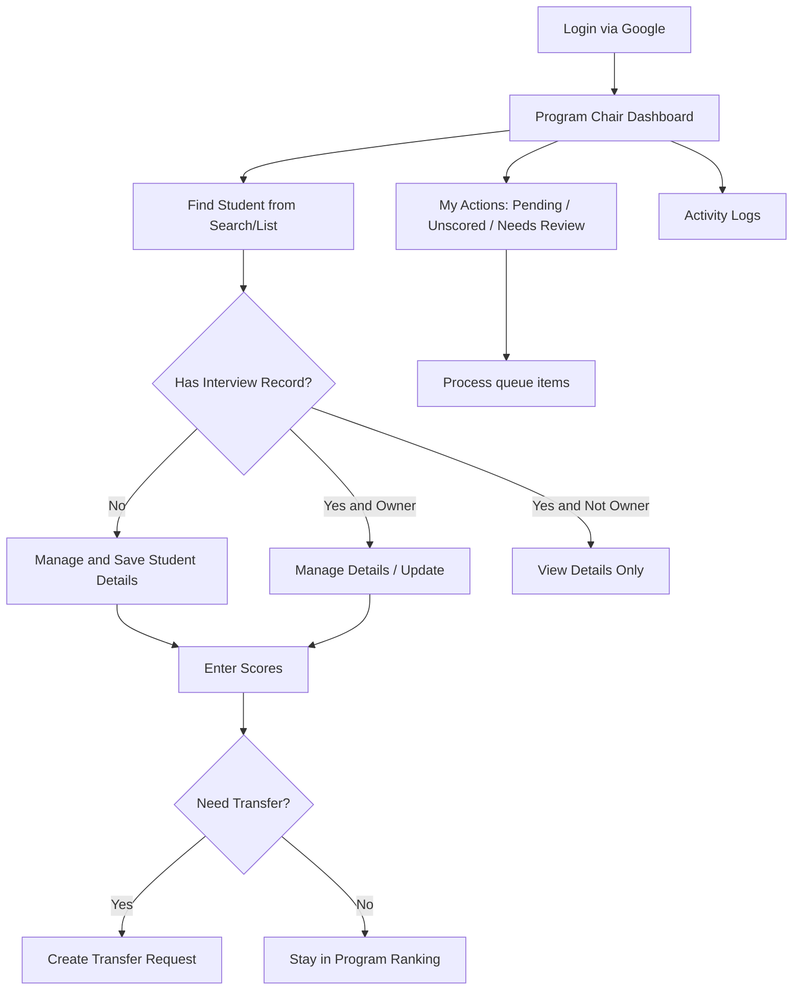
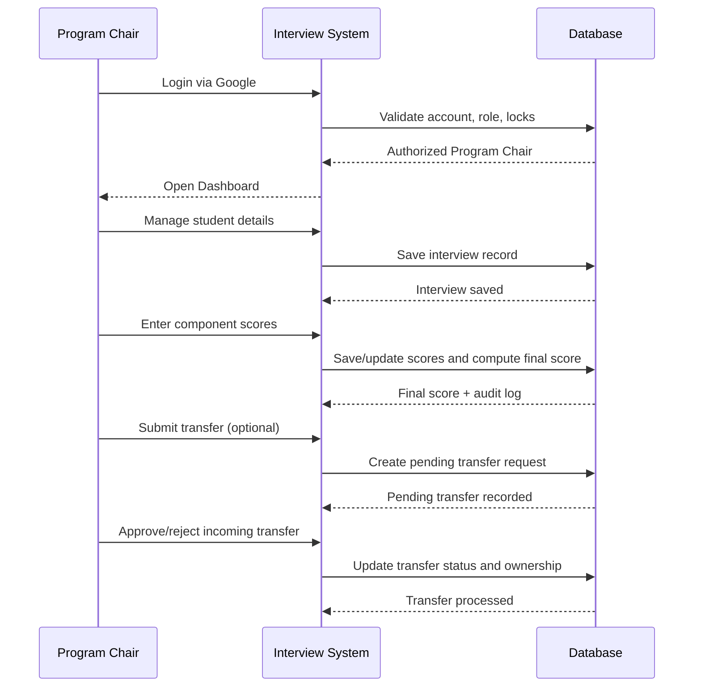

# Program Chair Module User Manual

This manual covers the **Program Chair module only**, starting from login at `localhost/interview/`.

## 1. Login (Program Chair)

1. Open `http://localhost/interview/`.
2. Click **Authorized Google Sign-In**.
3. Sign in with your official SKSU Google account.
4. If your role is Program Chair and your program is unlocked, you are redirected to `progchair/index.php`.

### Common login notes
- If non-admin login is locked, Program Chair login is blocked.
- If your specific program login is locked, access is blocked.
- If your account is inactive, access is blocked.

## 2. Quick Process Map (Image)

## 3. Dashboard Overview

After login, the dashboard shows:
- Student workspace (qualified list, search, scrolling list).
- Active cutoff information (global SAT cutoff or program SAT cutoff).
- Program cards (cutoff, scored count, capacity details).
- Sidebar action cards:
  - Pending Transfers
  - Unscored
  - Needs Review
  - Activity Logs

## 4. Main Workflow (Detailed)

## 4.1 Find student
1. Use the top search bar to search by examinee number or name.
2. Browse student cards and click the action button shown for each student.

Action buttons depend on status:
- **Manage**: no interview record yet.
- **Manage Details**: interview record exists and you are the owner.
- **View Details**: interview exists but not owned by your account.
- **Accept / Reject**: appears for pending transfer requests into your program.

## 4.2 Create or update student interview details
1. Click **Manage** or **Manage Details**.
2. Fill required fields:
- Classification (REGULAR/ETG)
- ETG Classification (required when ETG)
- Mobile number (`09XXXXXXXXX`)
- SHS Track
- 2nd and 3rd program choices
3. Click **Save**.

Important system behavior:
- 1st Choice is forced to your assigned Program Chair program.
- Only the owner Program Chair can update the interview record.
- On first save, student portal credentials are auto-provisioned.

## 4.3 Enter interview scores
1. In the student details modal, click **Enter Scores**.
2. Input component scores in the scoring page.
3. Click **Save Scores**.

Scoring behavior:
- SAT component is auto-loaded from placement and cannot be overridden.
- Final score is computed server-side from component weights.
- Only the owner Program Chair can save or update scores.
- Score actions are logged in Activity Logs.

## 4.4 Transfer student to another program
1. Click **Transfer** on a student card (owner-only action).
2. In transfer page, review student summary.
3. Select target program and submit transfer request.

Rules to remember:
- Only same-campus programs are listed.
- You cannot create a new transfer if one is already pending.
- If global SAT cutoff override is active, transfer follows that cutoff rule.

## 4.5 Approve/reject incoming transfers
1. Open **Pending Transfers** from sidebar (or action card).
2. Review each request.
3. Click **Approve** or **Reject**.

On approval:
- Interview ownership moves to the receiving Program Chair.
- Program assignment and first choice are updated to the receiving program.

## 4.6 Ranking, SCC endorsements, export
1. In right panel, click a program card (same-college programs are openable).
2. In Program Ranking modal:
- Review ranked list
- Use **Add SCC (Regular)** for eligible Regular students outside ranked regular list
- Use **Print** or **Export Excel**

SCC rules:
- Only REGULAR students can be added via SCC action.
- SCC follows endorsement capacity limits.
- Students already covered by regular ranking cannot be added through SCC.

## 4.7 Use My Actions queue for daily operations
- **Pending Transfers**: incoming transfer approvals.
- **Unscored**: interviews owned by you with no final score yet.
- **Needs Review**: scored interviews owned by you (without pending transfer).

Tip: process in this order each day:
1. Pending Transfers
2. Unscored
3. Needs Review

## 4.8 Review Activity Logs
1. Open **Activity Logs** from sidebar.
2. Review trend chart and detailed audit table.
3. Track actions such as SCORE_SAVE, SCORE_UPDATE, FINAL_SCORE_UPDATE.

## 5. Operational Process (Image)

## 6. Suggested Screenshot Checklist (for training handout)

Capture these actual screens and place them in your handout:
1. Login page with Google sign-in (`/index.php`).
2. Program Chair dashboard (`/progchair/index.php`).
3. Student card actions (Manage / Manage Details / View Details).
4. Student Details Verification modal.
5. Interview scoring page (`/progchair/interview_scores.php`).
6. Transfer page (`/progchair/transfer_student.php`).
7. Pending Transfers page (`/progchair/pending_transfers.php`).
8. Program Ranking modal (with Add SCC / Export).
9. Activity Logs page (`/progchair/activity_logs.php`).

## 7. Quick Troubleshooting

- Cannot login as Program Chair:
  - Confirm account is active.
  - Confirm non-admin login lock is OFF.
  - Confirm your program login lock is ON (unlocked for login).
- Student not visible in list:
  - Verify latest batch exists.
  - Check cutoff configuration (global or program cutoff).
- Cannot edit student details:
  - You must be the interview owner.
- Cannot transfer:
  - Resolve existing pending transfer first.
- Cannot add SCC endorsement:
  - Student must be REGULAR and SCC capacity must be available.
